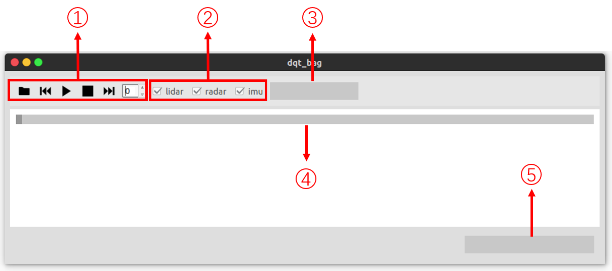

# Dqt_bag

|WX|2022.3.08|
|---|---|

### 1 Intruduction

录制感知数据包回放工具，支持选择传感器回放，选择任意时间点回放。

#### 依赖：

1 QT

2 PCL

3 vtk

4 Boost

5 dnet

### 2 How to use

#### 1) 界面

(1) 按键

|  按键   | 功能  |  按键   | 功能  |
|  ----  | ----  |  ----  | ----  |
|   | 打开文件 |  | 下一帧 |
|   | 暂停 |   | 开始 |
|   | 下一帧 |   | 结束 |

数显为当前帧数

##### 注意： 上一帧和下一帧应在回放暂停时执行

(2) 传感器选择

在打开文件前选择要回放的话题

(3) 日期显示

显示该数据包录制时间

(4) 进度条

数据回放进度条，同样可以拖动选择回放开始位置，需要在回放暂停时才可使用

(5) 时间戳

回放数据当前帧的时间

#### 2) 编译

    mkdir build
    cd build
    cmake ..
    make -j
